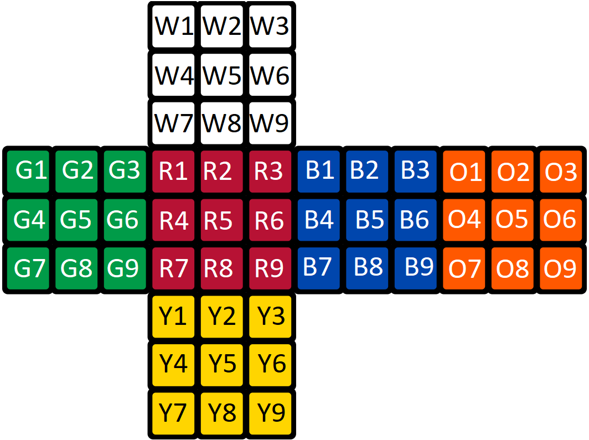
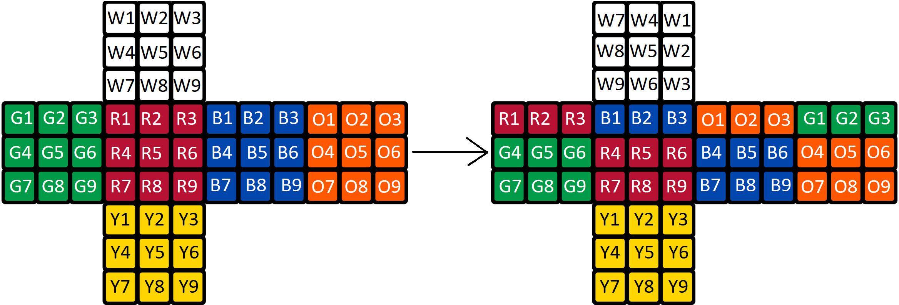
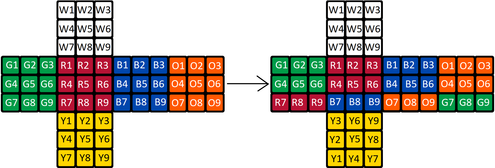
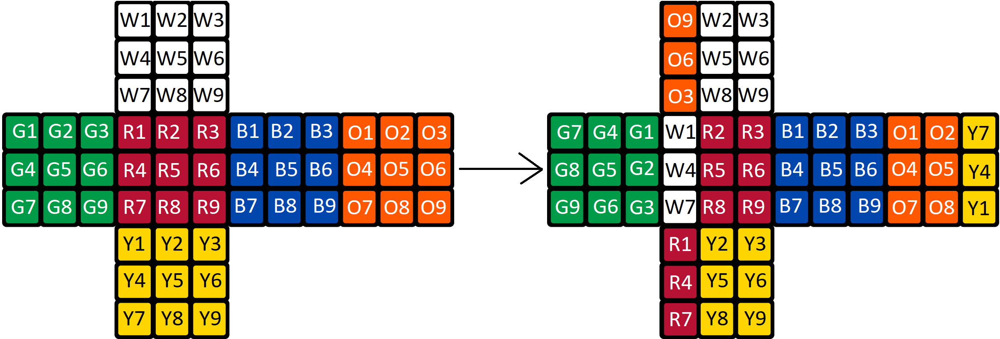
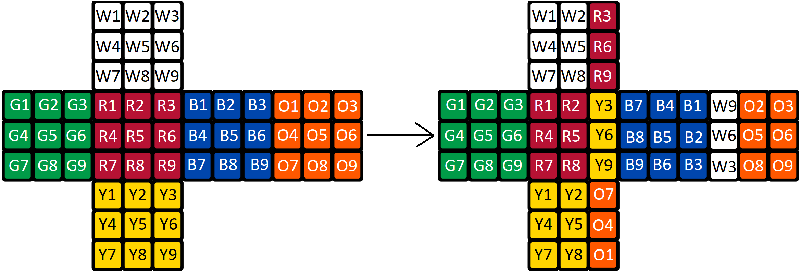
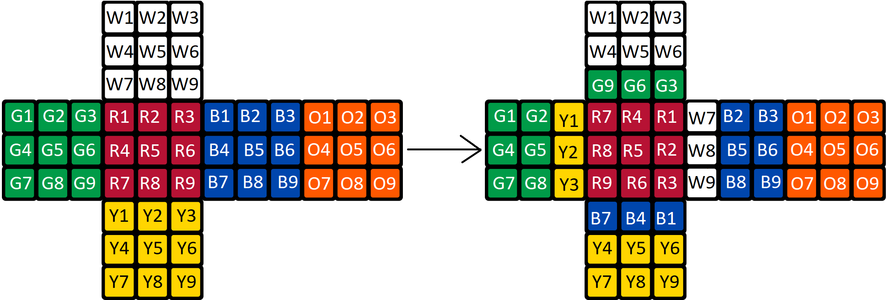
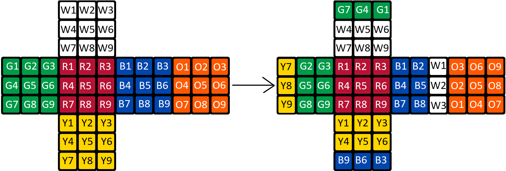

# **Rubiks cube solver**
Implementation of Rubiks cube solver in Haskell

## **Representation of a Cube**
We have a defined types and data structures: 
- `type Cube = (face, face, face, face, face, face)`
    - type which consists of 6 faces
- `type Face = (color, color, color, color, color, color, color, color, color)`
    - type which consists of 9 colors
- `data Color = W | R | G | B | Y | O`
    - data structure which represents color tile in a face
    - Can be one of 6 possible colors in a Rubik's cube: Red, Green, Blue, Yellow, Orange, White

( 
    (w1, w2, w3, w4, w5, w6, w7, w8, w9), 
    (g1, g2, g3, g4, g5, g6, g7, g8, g9), 
    (r1, r2, r3, r4, r5, r6, r7, r8, r9), 
    (b1, b2, b3, b4, b5, b6, b7, b8, b9), 
    (o1, o2, o3, o4, o5, o6, o7, o8, o9), 
    (y1, y2, y3, y4, y5, y6, y7, y8, y9) 
)

## **Moves**

### `u` - clockwise up

   
### `d` - clockwise down 

### `l` - clockwise left

### `r` - clockwise right

### `f` - clockwise front

### `b` - clockwise back

### counter-clockwise moves {`u'`, `d'`, `l'`, `r'`, `f'`, `b'`} are just inverse of clockwise moves 

## **Commands for solving a cube**
- `solveBfs` 
    - solves a given cube using regular bfs algorithm and finds the optimal count of moves to solve a cube but it is really slow for cubes which need more than 5 moves to solve (solution is always 21 or less moves long, because every cube can be solved in 21 moves or less, more info: [here](https://cube20.org/))
    - returns a list of moves to solve a cube
- `solveHuman`
    - solves a given cube going by stages and for each stage it uses bfs algorithm with more advanced moves (similar to how humans solve a cube)
    - returns a list of moves to solve a cube
    - much faster than solveBfs but won't find least moves to solve a cube

## **How to use it**
- clone this repository
- open terminal in the root of this repository
- run command `ghci`
- run command `:l src/Main.hs`
- run command `solveBfs cube` or `solveHuman cube` where cube is a cube you want to solve

## **Cubes to try**
### generate your own cube
- `generateCube` - function which takes a list of moves and returns a cube after applying those moves to a solvedCube
- example - `generateCube [u, l, f', l, r, b, u', u', r']`

### Test Cubes
|  |  |  |
|--|--|--|
|`solvedCube`|=|( (W,W,W,W,W,W,W,W,W), (G,G,G,G,G,G,G,G,G), (R,R,R,R,R,R,R,R,R), (B,B,B,B,B,B,B,B,B), (O,O,O,O,O,O,O,O,O), (Y,Y,Y,Y,Y,Y,Y,Y,Y) )|
|`r1`|=|( (W,W,W,W,W,W,W,W,W), (R,R,R,G,G,G,G,G,G), (B,B,B,R,R,R,R,R,R), (O,O,O,B,B,B,B,B,B), (G,G,G,O,O,O,O,O,O), (Y,Y,Y,Y,Y,Y,Y,Y,Y) )|
|`r2`|=|( (W,W,W,W,W,W,W,W,W), (R,R,R,G,G,G,R,R,R), (B,B,B,R,R,R,B,B,B), (O,O,O,B,B,B,O,O,O), (G,G,G,O,O,O,G,G,G), (Y,Y,Y,Y,Y,Y,Y,Y,Y) )|
|`r3`|=|( (W,W,W,W,W,W,R,G,R), (R,R,Y,G,G,Y,R,R,Y), (B,R,B,B,R,B,B,R,B), (W,O,O,W,B,B,W,O,O), (G,G,G,O,O,O,G,G,G), (O,B,O,Y,Y,Y,Y,Y,Y) )|
|`r4`|=|( (W,W,W,W,W,W,Y,Y,Y), (R,R,O,G,G,B,R,R,O), (B,B,B,R,R,R,B,B,B), (R,O,O,G,B,B,R,O,O), (G,G,G,O,O,O,G,G,G), (W,W,W,Y,Y,Y,Y,Y,Y) )|
|`r5`|=|( (W,W,W,W,W,W,Y,Y,Y), (R,R,O,G,G,B,B,B,B), (B,B,B,R,R,R,R,O,O), (R,O,O,G,B,B,G,G,G), (G,G,G,O,O,O,R,R,O), (W,Y,Y,W,Y,Y,W,Y,Y) )|
|`r6`|=|( (O,W,W,O,W,W,G,Y,Y), (B,G,R,B,G,R,B,B,O), (W,B,B,W,R,R,Y,O,O), (R,O,O,G,B,B,G,G,G), (G,G,W,O,O,W,R,R,W), (B,Y,Y,R,Y,Y,R,Y,Y) )|
|`r7`|=|( (B,B,B,O,W,W,G,Y,Y), (R,G,R,Y,G,R,Y,B,O), (W,B,B,W,R,R,Y,O,O), (R,O,O,G,B,W,G,G,W), (W,W,W,G,O,R,G,O,R), (B,Y,Y,R,Y,Y,G,B,O) )|
|`r8`|=|( (Y,Y,R,O,W,W,G,Y,Y), (G,G,R,B,G,R,O,B,O), (W,B,B,W,R,R,Y,O,O), (R,O,B,G,B,B,G,G,B), (W,R,R,W,O,O,W,G,G), (B,Y,Y,R,Y,Y,W,W,O) )|
|`r9`|=|( (O,B,G,O,W,W,G,Y,Y), (W,G,R,W,G,R,O,B,O), (W,B,B,W,R,R,Y,O,O), (R,O,Y,G,B,Y,G,G,R), (R,O,G,R,O,G,W,W,W), (B,Y,Y,R,Y,Y,B,B,B) )|
|`r10`|=|( (W,B,G,G,W,W,G,Y,Y), (O,W,W,B,G,G,O,R,R), (O,B,B,O,R,R,G,O,O), (R,O,Y,G,B,Y,G,G,R), (R,O,B,R,O,R,W,W,B), (W,Y,Y,W,Y,Y,Y,B,B) )|
|`r11`|=|( (W,B,G,G,W,W,R,G,W), (O,W,W,B,G,Y,O,R,Y), (G,O,O,O,R,B,O,R,B), (G,O,Y,Y,B,Y,Y,G,R), (R,O,B,R,O,R,W,W,B), (G,G,R,W,Y,Y,Y,B,B) )|
|`r12`|=|( (W,B,O,G,W,B,R,G,B), (O,W,W,B,G,Y,O,R,Y), (G,O,R,O,R,Y,O,R,B), (Y,Y,G,G,B,O,R,Y,Y), (W,O,B,W,O,R,G,W,B), (G,G,W,W,Y,R,Y,B,R) )|
|`r13`|=|( (W,B,R,G,W,Y,R,G,B), (O,W,W,B,G,Y,O,R,Y), (G,O,W,O,R,R,O,R,R), (R,G,Y,Y,B,Y,Y,O,G), (B,O,B,B,O,R,O,W,B), (G,G,G,W,Y,W,Y,B,W) )|
|`r14`|=|( (O,B,O,G,W,Y,R,G,B), (Y,W,W,B,G,Y,W,R,Y), (G,O,W,O,R,R,O,R,R), (R,G,W,Y,B,B,Y,O,R), (B,R,B,O,O,W,B,B,O), (G,G,G,W,Y,W,G,Y,Y) )|

## **Algorithm**
- **Bfs** - uses regular bfs algorithm to find least moves to solve a cube
    - first, we make a state out of given cube and add it to a queue
    - then we pop a state from a queue, check if it is a solved cube:
        - if yes, we end, and return this state. with another function `extractSolution` we extract moves from this state and return them (we can do this, because we store previous state and move that got us here in each state) 
        - if not, we generate new states by applying possible moves to this state and filter out states that we already visited
    - then we add these states to a set of visited states and to end of a queue
    - we repeat this process until we find a state which is solved
- **Human approach** - uses human approach to solve a cube
    - solves rubiks cube from stage to stage by applying bfs algorithm to each stage with more advanced moves
    - used much more moves than bfs algorithm but it is by far more faster
    - stages:
        - "white cross" --> "first layer" --> "second layer" --> "last layer" --> "solved cube"
- **Queue**
    - queue is implemented by 2 lists, where first one is pop-list and second one is push-list, when pop-list is empty, we reverse push-list and copy it to pop-list (should be O(1) amortized)